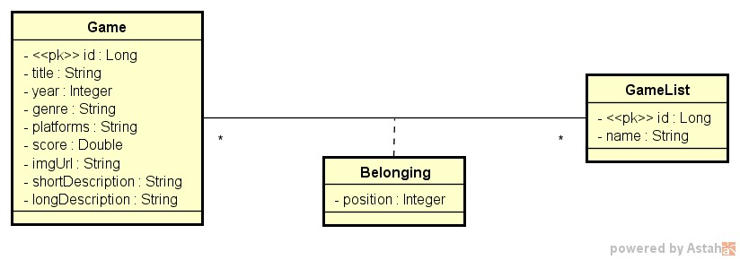

# DS-List
[](https://github.com/Lucas-iferreira/rpg-list/blob/main/LICENSE) 

# Sobre o projeto
Intensivão Java SpringBoot realizado pela [DevSuperior](https://devsuperior.com.br).

Uma API com endpoints de leitura(GET) e mudança de posição(POST), que consiste, especificamente, em uma lista de duas coleções.
Quando acessado uma das coleções, retorna todos as especificações dos jogos: Genero, avaliação, descrição, plataformas.

# Objetivo

- Organizar o projeto em padrão camadas
- Praticar o mapeamento de muitos para muitos
- Configurar banco de dados de teste (H2)
- Praticar a utilização do DOCKER com a imagem do PGAdmin  
- Povoar o banco de dados com dados de teste

## Modelo conceitual


# Tecnologias utilizadas
- Java 21
- Spring Boot
- Maven
- Postman
- Docker

# Dependencias 
- Spring Web
- Spring Data JPA
- H2
- PostgreSQL

# Como executar o projeto

Pré-requisitos: Java 21

```bash
# clonar repositório
git clone https://github.com/Lucas-iferreira/rpg-list.git

# Seed para povoar o banco de dados já incluso no projeto -> "import.sql"

# entrar na pasta do projeto back end
cd backend

# executar o projeto
./mvnw spring-boot:run

# Acessar o banco de dados H2
localhost:8080/h2-console

# Acessar os Endpoints no Postman
GET listas -> http://localhost:8080/lists
GET lista id=1 -> http://localhost:8080/lists/1/games
POST modificar a posição de um jogo em uma lista -> http://localhost:8080/lists/2/replacement
```

# Agradecimentos
Agradeço ao professor [Nelio Alves](https://www.linkedin.com/in/nelio-alves/) pelo projeto realizado junto ao seu Intensivão de Spring Boot, que me proporcionou ganhos 
de conhecimentos notáveis na linguagem e na framework.

# Autor

Lucas Ferreira

https://www.linkedin.com/in/lucas-iferreira/
